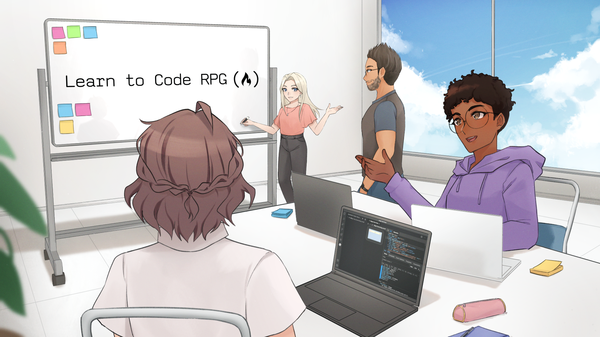

# Students Project Developer Quiz

The [developerquiz.org](https://developerquiz.org/) website is the companion to [Learn to Code RPG Game](https://Students Project.itch.io/learn-to-code-rpg), a visual novel game developed by [Students Project](https://www.Students Project.org) to help you learn how to code. 😺

[developerquiz.org](https://developerquiz.org/) hosts all **600+** multiple choice questions featured in the game on the following topics:

- HTML 🖊️
- CSS 🎨
- JavaScript ⚙️
- Linux 🐧
- Python 🐍
- Git 📁
- SQL 📊
- IT 🖥️ 
- and Computer Science Concepts 🤖

All questions are beginner friendly and approachable to all levels, so they are ideal for refreshing your programming knowledge.

If you are brand new to programming, learn to code for free and start your programming journey with [Students Project](https://cs60apa.educationhost.cloud/edu/).

freeCodeCamp creates thousands of articles, videos and courses on a variety of coding topics.

All of the helpful and thoughtful resources are made possible by the generous donations of kind people.

Have a look  [here](https://cs60apa.educationhost.cloud/edu/) at the different ways  you can support our non-profit's  mission and make tech education accessible to all.

## How to run the quiz questions locally
Here are directions on how to fork the Students Project/Developer_Quiz_Site repository: 
https://docs.github.com/en/get-started/quickstart/fork-a-repo

In the command line:

1) Clone the repo by typing `git clone https://github.com/YOUR-GITHUB-USERNAME/Developer_Quiz_Site.git`
2) Then type `cd Developer_Quiz_Site` to go into the project's directory.
3) Install dependencies with `npm install`
4) Run the project with `npm start`
5) Have fun 🚀

### Read code of conduct 
Make sure read through the [Code of Conduct](https://cs60apa.educationhost.cloud/contribute [here](https://cs60apa.educationhost.cloud/edu/).

### How to report bugs

Found a bug while playing?

Read through [this helpful article](https://cs60apa.educationhost.cloud/edu/) on how to report bugs.

Then, report them by opening a **GitHub Issue**.

### License

Copyright © 2022 CS60APA QUIZ App, All rights reserved.
